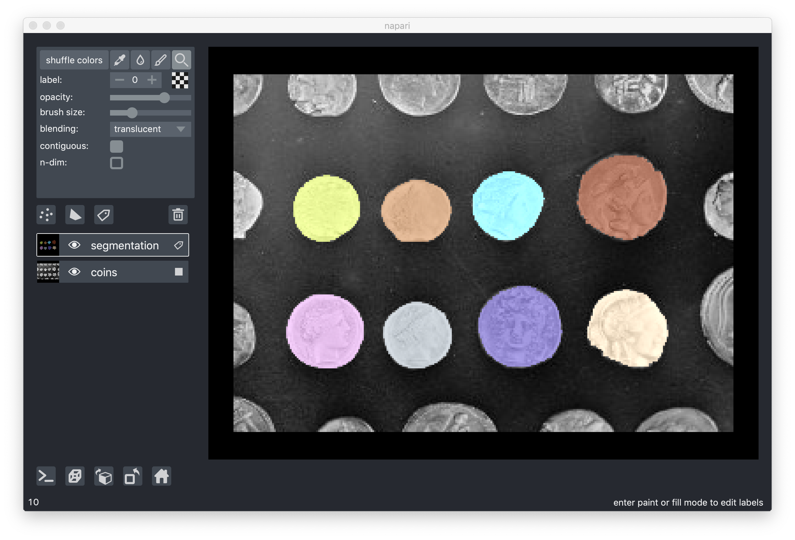
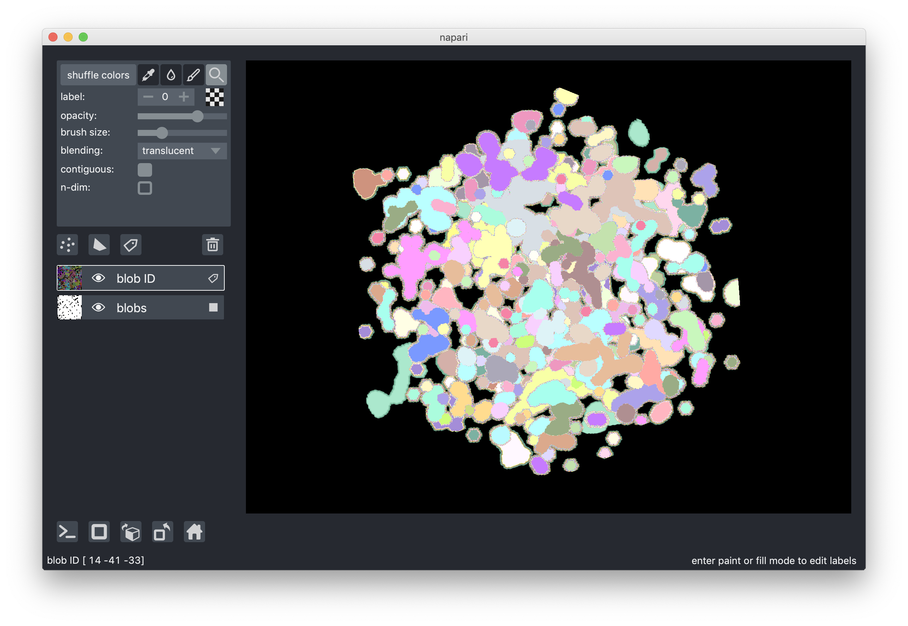
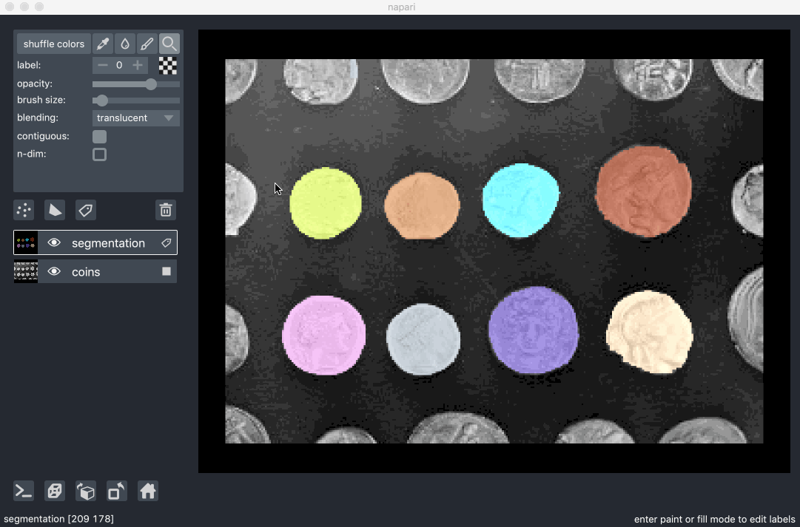

# labels layer tutorial

Welcome to the tutorial on the **napari** `Labels` layer!

This tutorial assumes you have already installed **napari**, know how to launch the viewer, and are familiar with its layout. For help with installation see our [installation](installation.md) tutorial. For help getting started with the viewer see our [getting started](getting_started.md) tutorial. For help understanding the organisation of the viewer, including things like the layers list, the layer properties widgets, the layer control panels, and the dimension sliders see our [napari viewer](viewer.md) tutorial.

This tutorial will teach you about the **napari** `Labels` layer, including using the layer to display the results of image segmentation analyses, and how to manually segment images using the paintbrush and fill buckets. At the end of the tutorial you should understand how to add a labels image and edit it from the GUI and from the console.

The labels layer allows you to take an array of integers and display each integer as a different random color, with the background color 0 rendered as transparent.

The labels layer therefore very useful for segmentation tasks where each pixel is assigned to a different class, as occurs in semantic segmentation, or where pixels corresponding to different objects all get assigned the same label, as occurs in instance segmentation.

## a simple example

You can create a new viewer and add an labels image in one go using the `napari.view_labels` method, or if you already have an existing viewer, you can add a labels image to it using `viewer.add_labels`. The api of both methods is the same. In these examples we'll mainly use `add_labels` to overlay a labels image onto on image.

In this example of instance segmentation we will find and segment each of the coins in an image, assigning each one an integer label, and then overlay the results on the original image as follows:

```python
from skimage import data
from skimage.filters import threshold_otsu
from skimage.segmentation import clear_border
from skimage.measure import label
from skimage.morphology import closing, square, remove_small_objects
import napari


coins = data.coins()[50:-50, 50:-50]
# apply threshold
thresh = threshold_otsu(coins)
bw = closing(coins > thresh, square(4))
# remove artifacts connected to image border
cleared = remove_small_objects(clear_border(bw), 20)
# label image regions
label_image = label(cleared)

with napari.gui_qt():
    # create the viewer and add the coins image
    viewer = napari.view_image(coins, name='coins')
    # add the labels
    viewer.add_labels(label_image, name='segmentation')
```



## arguments of view_labels and add_labels

Both `view_labels` and `add_labels` have the following doc strings:

**insert formatted doc strings here**

## labels data

The labels layer is a subclass of the `Image` layer and as such can support the same numpy-like arrays, including [dask arrays](https://docs.dask.org/en/stable/array.html), an [xarrays](http://xarray.pydata.org/en/stable/generated/xarray.DataArray.html), and [zarr arrays](https://zarr.readthedocs.io/en/stable/api/core.html). A labels layer though must be integer valued, and the background label must be 0.

Because the labels layer subclasses the image layer it inherits the great properties of the image layer, like supporting lazy loading and image pyramids for big data layers. For more information about both these concepts see the details in the [image layer](image.md) tutorial.


## creating a new labels layer

As you can edit a labels layer using the paintbrush and fill bucket, it is possible to create a brand new empty labels layers by clicking the new labels layer button above the layers list. The shape of the new labels layer will match the size of any currently existing image layers, allowing you to paint on top of them.

## non-editable mode

If you want to disable editing of the labels layer you can set the `editable` property of the layer to `False`.

As note in the section on 3D rendering, when using 3D rendering the labels layer is not editable. Similarly for now, a labels layer where the data is represented as an image pyramid is not editable.

## 3D rendering of labels

All our layers can be rendered in both 2D and 3D mode, and one of our viewer buttons can toggle between each mode. The number of dimensions sliders will be 2 or 3 less then the total number of dimensions of the layer, allowing you to browse volumetric timeseries data and other high dimensional data. See for example the labeled blobs in 3D in the `examples/nD_labels.py`:



Note though that when entering 3D rendering mode the colorpicker, paintbrush, and fill bucket options which allow for layer editing are all disabled. Those options are only supported when viewing a layer using 2D rendering.

## pan and zoom mode

The default mode of the labels layer is to support panning and zooming, as in the image layer. This mode is represent by the magnifying glass in the layers control panel, and while it is selected editing the layer is not possible. Continue reading to learn how to use some of the editing modes. You can always return to pan and zoom mode by pressing the `Z` key when the labels layer is selected.

## changing labels colors

The color that each integer gets assigned is random, aside from 0 which always gets assigned to be transparent. The colormap we use is designed such that nearby integers get assigned very different colors. The exact colors that get assigned as determined by a [random seed](https://docs.scipy.org/doc/numpy-1.15.1/reference/generated/numpy.random.seed.html) and changing that seed will shuffle the colors that each label gets assigned. Changing the seed can be done by clicking on the `shuffle colors` button in the layers control panel.

## selecting a label
A particular label can be selected either using the label combobox inside the layers control panel and typing in the value of the desired label or using the plus / minus buttons, or by selecting the color picker tool and then clicking on a pixel with the desired label in the image. When a label is selected you will see its integer inside the label combobox and the color or the label shown in the thumbnail next to the label combobox. If the 0 label is selected then a checkerboard pattern is shown in the thumbnail to represent the transparent color.

You can quickly select the color picker by pressing the `L` key when the labels layer is selected.

You can set the selected label to be 0, the background label, by pressing `E`.

You can set the selected label to be one larger than the current largest label by pressing `M`. This selection will guarantee that you are then using a label that hasn't been used before.

You can also increment or decrement the currently selected label by pressing the `I` or `D` key respectively.

## painting in the labels layer
One of the major use cases for the labels layer is to manually edit or create image segmentations. One of the tools that can be used for manual editing is the `paintbrush`, that can be made active from by clicking the paintbrush icon in the layers control panel. Once the paintbrush is enable the pan and zoom functionality of the  viewer canvas gets disabled and you are able to paint onto the canvas. You can temporarily re-enable pan and zoom by pressing and holding the spacebar. This feature can be useful if you want to move around the labels layer as you paint.

When you start painting the label that you are painting with, and the color that you will see are determined by the selected label. Note there is no explicit eraser tool, instead you just need to make the selected label 0 and then you are effectively painting with the background color. Remember you can use the color picker tool at any point to change the selected label.

You can adjust the size of your paintbrush using the brush size slider, making it as small as a single pixel for very detailed painting.

If you have a multidimensional labels layer then your paintbrush will only edit data in the visible slice by default; however, if you enable the `n_dimensional` property and paintbrush then your paintbrush will extend out into neighbouring slices according to its size.

You can quickly select the paintbrush by pressing the `P` key when the labels layer is selected.

## using in the fill bucket

Sometimes you might want to replace an entire label with a different label. This could be because you want to make two touching regions have the same label, or you want to just replace one label with a different one, or maybe you have painted around the edge of a region and you want to quickly fill in its inside. To do this you can select the `fill bucket` by clicking on its icon in the layer controls panel and then click on a target region of interest in the layer. The fill bucket will fill using the currently selected label.

By default the fill bucket will only change contiguous or connected pixels of the same label as the pixel that is clicked on. If you want to change all the pixels of that label regardless of where they are in the slice then you can set the `contiguous` property or checkbox to `False`.

If you have a multidimensional labels layer then your fill bucket will only edit data in the visible slice by default; however, if you enable the `n_dimensional` property and paintbrush then your fill bucket will extend out into neighbouring slices, either to all pixels with that label in the layer, or only connected pixels depending on if the contiguous property is disabled or not.

You can quickly select the fill bucket by pressing the `F` key when the labels layer is selected.

Using the paintbrush and fill bucket together we can quickly segment one of the coins at the border of our image with a new label:



## undo / redo functionality

When painting or using the fill bucket it can be easy to make a mistake that you might want to undo or then redo. For the labels layer we support an undo with `ctrl-Z` and redo with `shift-ctrl-Z`. We plan to support this sort of functionality more generally, but for now these actions will undo the most recent painting or filling event, up to 100 events in the past.

If you have multidimensional data then adjusting the currently viewed slice will cause the undo history to be reset.

## layer visibility

All our layers support a visibility toggle that allows you to set the `visible` property of each layer. This property is located inside the layer widget in the layers list and is represented by an eye icon.

## layer opacity

All our layers support an opacity slider and `opacity` property that allow you to adjust the layer opacity between 0, fully invisible, and 1, fully visible.

## blending layers

All our layers support three blending modes `translucent`, `additive`, and `opaque` that determine how the visuals for this layer get mixed with the visuals from the other layers.

An `opaque` layer renders all the other layers below it invisibile, and will fade to black as you decrease its opacity.

The `translucent` setting will cause the layer to blend with the layers below it if you decrease its opacity, but will fully block those layers if its opacity is 1. This is a reasonable default, useful for many applications.

## naming layers

All our layers support a `name` property that can be set inside a text box inside the layer widget in the layers list. The name of each layer is forced into being unique so that you can use the name to index into `viewer.layers` to retrieve the layer object.

## scaling layers

All our layers support a `scale` property and keyword argument that will rescale the layer multiplicatively according to the scale values (one for each dimension). This property can be particularly useful for viewing anisotropic volumes where the size of the voxel in the z dimension might be different then the size in the x and y dimensions.

## translating layers

All our layers support a `translate` property and keyword argument that you can use to offset a layer relative to the other layers, which could be useful if you are trying to overlay two layers for image registration purposes.

## layer metadata

All our layers also support a `metadata` property and keyword argument that you can use to store an arbitrary metadata dictionary on the layer.

## next steps

Hopefully this tutorial has given you a detailed understanding of the `Labels` layer, including how to create one and control its properties. To learn more about some of the other layer types that **napari** supports checkout some more of our tutorials listed below. The [points layer](points.md) tutorial is a great one to try next as points are one of our simplest shape-like layers.

## all tutorials

- [welcome](../README.md)
- [installing napari](installation.md)
- [getting started tutorial](getting_started.md)
- [viewer tutorial](viewer.md)
- [image layer tutorial](image.md)
- [labels layer tutorial](labels.md)
- [points layer tutorial](points.md)
- [shapes layer tutorial](shapes.md)
- [surface layer tutorial](surface.md)
- [vectors layer tutorial](vectors.md)
- [gallery](../gallery/gallery.md)
